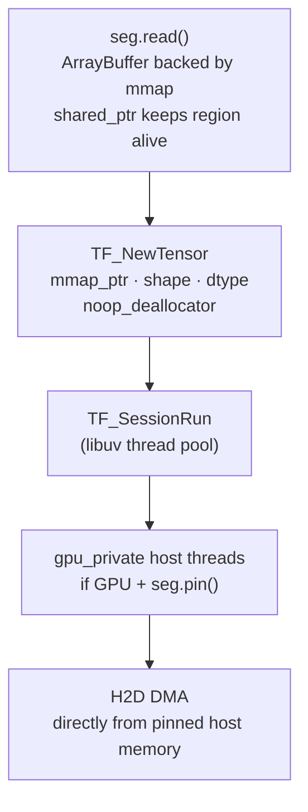

# jude-tf

TensorFlow C API bindings for Node.js with zero-copy inference via [jude-map](../jude-map).

Loads frozen graphs and TF1-compat SavedModels, auto-detects inputs and outputs, and hands jude-map mmap pointers straight into `TF_NewTensor` — no intermediate copy between your data pipeline and the TF runtime. Inference runs on the libuv thread pool via `runAsync()` so the event loop stays alive during compute.

---

## Why not tfjs-node?

`tfjs-node` bundles its own internal copy of libtensorflow but only exposes a JavaScript surface over it. You cannot pass an external memory pointer to it, cannot control tensor lifetime, and cannot reach `TF_NewTensor` with a noop deallocator. The moment you need zero-copy inference from a large shared buffer — or anything larger than ~2 GB — tfjs-node is the wrong tool.

jude-tf exposes the C API directly:

- `TF_NewTensor` with a noop deallocator — the mmap pointer goes in, no copy
- `TF_SessionRun` on the libuv thread pool — event loop alive during inference
- GPU `gpu_private` host threads see the buffer as pinned host memory when `seg.pin()` has been called — H2D DMA without a staging copy

---

## Model format support

| Format                | Load method         | Variables                       | Notes                                       |
| --------------------- | ------------------- | ------------------------------- | ------------------------------------------- |
| Frozen graph (`.pb`)  | `loadFrozenGraph()` | Baked as `Const`                | **Recommended for all TF2/Keras models**    |
| TF1-compat SavedModel | `loadSavedModel()`  | Restored via `save/restore_all` | `tf.compat.v1.saved_model.simple_save` only |
| TF2 SavedModel        | —                   | ❌ C API limitation             | Use `freeze()` + `loadFrozenGraph()`        |

### TF2/Keras models: freeze first

TF2 `tf.saved_model.save` stores weights as `ResourceVariable` handles that are only accessible from Python's eager runtime. The TF C API session cannot restore them ([tensorflow#46052](https://github.com/tensorflow/tensorflow/issues/46052)). The solution is to freeze the model once during model preparation — inlining all variable values as `Const` nodes — and then load the resulting `.pb` for all subsequent inference.

```ts
import { TFSession } from "jude-tf";

// One-time offline step — shells out to Python, runs convert_variables_to_constants_v2.
// Commit model.pb to your repo or container image.
TFSession.freeze("./my_keras_model", "./model.pb");

// All inference from here is pure C++ — zero Python, zero variable restoration.
const sess = await TFSession.loadFrozenGraph("./model.pb");
const result = await sess.runAsync({ inputs: new Float32Array(784).fill(0.5) });
sess.destroy();
```

`freeze()` requires Python with TensorFlow installed (`pip install tensorflow`). It is synchronous and meant for build/deployment pipelines, not the request path. Once `.pb` is produced, Python is never involved again.

### Generating a test model

```python
import tensorflow as tf, numpy as np

# TF2 Keras model
x = tf.keras.Input(shape=(4,), name="inputs")
y = tf.keras.layers.Dense(2, activation="relu", name="output")(x)
model = tf.keras.Model(inputs=x, outputs=y)
model(np.zeros((1, 4), dtype=np.float32))   # materialise weights
tf.saved_model.save(model, "./my_model")
```

```ts
TFSession.freeze("./my_model", "./model.pb");
const sess = await TFSession.loadFrozenGraph("./model.pb");
```

### Future: native freeze

Once jude-tf's C API surface is complete, native freezing (without Python) is achievable by parsing the checkpoint `.index`/`.data` files directly and patching the `GraphDef` proto to replace `ReadVariableOp` nodes with `Const` nodes. This is documented as a future roadmap item — for now Python's `convert_variables_to_constants_v2` is the correct tool.

---

## Requirements

- Node.js >= 18
- jude-map >= 0.0.0-alpha (peer dependency)
- libtensorflow 2.x C library — [install instructions below](#installing-libtensorflow)
- `freeze()` only: Python 3 + `pip install tensorflow`
- Build toolchain (if prebuilds unavailable):
  - Linux/macOS: GCC or Clang with C++17, Python 3
  - Windows: Visual Studio 2022, "Desktop development with C++", Python 3

---

## Installing libtensorflow

Set `LIBTENSORFLOW_PATH` before building if you install to a non-default location.

**Linux:**

```bash
wget https://storage.googleapis.com/tensorflow/versions/2.18.1/libtensorflow-cpu-linux-x86_64.tar.gz
sudo tar -C /usr/local -xzf libtensorflow-cpu-linux-x86_64.tar.gz
sudo ldconfig
```

**macOS:**

```bash
# Apple Silicon
wget https://storage.googleapis.com/tensorflow/versions/2.18.1/libtensorflow-cpu-darwin-arm64.tar.gz
sudo tar -C /usr/local -xzf libtensorflow-cpu-darwin-arm64.tar.gz
```

**Windows (PowerShell):**

```powershell
Invoke-WebRequest -Uri "https://storage.googleapis.com/tensorflow/versions/2.18.1/libtensorflow-cpu-windows-x86_64.zip" -OutFile libtf.zip
Expand-Archive libtf.zip -DestinationPath C:\libtensorflow
[Environment]::SetEnvironmentVariable("PATH", $env:PATH + ";C:\libtensorflow\lib", "User")
$env:LIBTENSORFLOW_PATH = "C:\libtensorflow"
```

---

## Installation

```bash
npm install jude-tf
```

Building from source:

```bash
cd jude-tf
npm ci
npm run build
```

---

## Quick start

```ts
import { TFSession } from "jude-tf";
import { SharedTensorSegment, DType } from "jude-map";

// Freeze once (requires Python + tensorflow)
TFSession.freeze("./my_model", "./model.pb");

// Load — pure C++
const sess = await TFSession.loadFrozenGraph("./model.pb");

// Zero-copy inference — mmap pointer → TF_NewTensor, no copy
const seg = new SharedTensorSegment(4 * 4); // 4 float32 elements
seg.fill([4], DType.FLOAT32, 0.5);

// runAsync — TF_SessionRun on libuv thread pool, event loop stays alive
const result = await sess.runAsync({ inputs: seg });
console.log(result.Identity.data); // Float32Array

seg.destroy();
sess.destroy();
```

---

## Zero-copy inference path



No data is copied. TensorFlow borrows the buffer for the duration of `TF_SessionRun`. The `shared_ptr<MmapRegion>` in jude-map ensures the mapping stays valid across the async gap in `runAsync()`.

---

## API

### `TFSession.freeze(savedModelDir, outputPath, options?)`

One-time offline utility. Converts a SavedModel to a frozen `.pb` by inlining all variables as constants. Requires Python with TensorFlow installed.

- `savedModelDir` — path to the SavedModel directory
- `outputPath` — where to write the frozen `.pb`
- `options.pythonBin` — Python executable (default: auto-detect `python` / `python3`)
- `options.tags` — MetaGraph tags (default: `["serve"]`)

Throws on failure. Writes a `[jude-tf] freeze: N ops → path` message to stderr on success.

### `TFSession.loadFrozenGraph(path)`

Loads a frozen `GraphDef` from a `.pb` file. Inputs are inferred from `Placeholder` ops. Use op names as input keys in `run()` / `runAsync()`.

Returns `Promise<TFSession>`.

### `TFSession.loadSavedModel(dir, tags?)`

Loads a TF1-compat SavedModel. Variables are restored via the `save/restore_all` op. Only works with models saved via `tf.compat.v1.saved_model.simple_save` or the TF1 `SavedModelBuilder`. TF2 models require `freeze()` + `loadFrozenGraph()`.

Returns `Promise<TFSession>`.

### `sess.run(inputs, outputKeys?)`

Synchronous inference — blocks the event loop during `TF_SessionRun`. Use on Worker threads. Use `runAsync()` on the main thread.

- `inputs` — map from input key to data source:
  - `SharedTensorSegment` — zero-copy, mmap pointer passed directly to `TF_NewTensor`
  - `TypedArray` — copied into a new `TF_Tensor`
- `outputKeys` — which output ops to fetch (default: all inferred outputs)

Returns `Promise<Record<string, TensorResult>>`.

### `sess.runAsync(inputs, outputKeys?)`

Non-blocking inference. `TF_SessionRun` runs on the libuv thread pool — the event loop stays free for I/O, timers, and other work during inference. Same signature as `run()`.

### `sess.inputs`

String array of inferred `Placeholder` op names (frozen graphs). Empty for SavedModels.

### `sess.outputs`

String array of inferred output op names (frozen graphs). Empty for SavedModels.

### `sess.signatures` / `sess.activeSignature`

All `SignatureDef` entries parsed from `saved_model.pb`. Empty for frozen graphs. `activeSignature` returns `serving_default` or the first available.

### `sess.destroy()`

Closes the TF session and releases all C++ resources.

---

## Building from source

```bash
# From the repo root
npm install
LIBTENSORFLOW_PATH=/usr/local npm run build --workspace=jude-tf

# Or from the jude-tf directory
cd jude-tf
LIBTENSORFLOW_PATH=/usr/local npm run build
npm test
```

On Windows, set `LIBTENSORFLOW_PATH` as a user environment variable rather than inline.

---

## Current status

- [x] Frozen graph loading and inference
- [x] TF1-compat SavedModel loading (simple_save)
- [x] SignatureDef auto-detection (binary protobuf parser, no runtime dependency)
- [x] Zero-copy inference from jude-map segments
- [x] TypedArray input path (copy)
- [x] CPU inference
- [x] `runAsync()` — `TF_SessionRun` on libuv thread pool (event loop free during inference)
- [x] `freeze()` — SavedModel → frozen graph via Python (offline, not on inference path)
- [ ] Native freeze — parse checkpoint + patch GraphDef proto in C++, no Python required
- [ ] SavedModel loading for TF2 models — blocked by TF C API ResourceVariable limitation ([tensorflow#46052](https://github.com/tensorflow/tensorflow/issues/46052))
- [ ] GPU inference path (CUDA session options, `TF_GPU_THREAD_MODE`)
- [ ] TFLite (separate `jude-tflite` package)

---

## License

Apache-2.0 © Alan Kochukalam George
